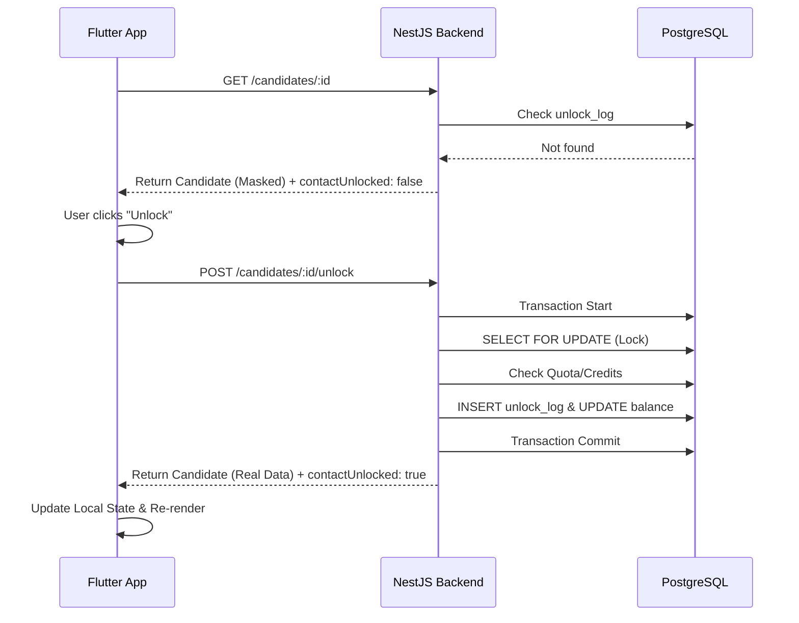

# Flutter Integration Guide: Candidate Contact Unlock

Tài liệu này hướng dẫn cách triển khai luồng mở khóa thông tin liên hệ ứng viên (Unlock Contact) trên ứng dụng Flutter, tương tác với hệ thống NestJS hiện tại.

## 1. Tổng quan luồng dữ liệu (Data Flow)

Hệ thống sử dụng cơ chế **Server-side Masking**. Dữ liệu nhạy cảm luôn được ẩn từ phía Backend trừ khi đã được mở khóa.

1. **Giai đoạn 1 (List/Search)**: App gọi API tìm kiếm. Backend trả về danh sách ứng viên với flag `contactUnlocked: false`. Các trường `phone`, `email`, `cvUrl` sẽ là dữ liệu giả (ví dụ: `0*********`).
2. **Giai đoạn 2 (Detail View)**: App gọi API chi tiết. Nếu chưa mở khóa, UI hiển thị nút "Mở khóa".
3. **Giai đoạn 3 (Unlock Action)**: App gọi API POST unlock. Backend kiểm tra Quota (VIP) hoặc trừ Credit. Nếu thành công, Backend trả về dữ liệu thật.
4. **Giai đoạn 4 (Update UI)**: App cập nhật State cục bộ để hiển thị thông tin thật mà không cần reload danh sách.

## 2. Các API Endpoint cần thiết

| Feature | Method | Endpoint                                           | Note                                |
| ------- | ------ | -------------------------------------------------- | ----------------------------------- |
| Search  | GET    | `/api/employers/headhunting/candidates`            | Trả về list ứng viên (đã mask)      |
| Detail  | GET    | `/api/employers/headhunting/candidates/:id`        | Trả về thông tin chi tiết           |
| Unlock  | POST   | `/api/employers/headhunting/candidates/:id/unlock` | Thực hiện trừ tiền/quota            |
| Quota   | GET    | `/api/employers/headhunting/quota`                 | Lấy số lượt xem còn lại trong tháng |

---

## 3. Cấu trúc Model (Dart)

```dart
class Candidate {
  final int id;
  final String fullName;
  final String? phone; // Sẽ là "0*********" nếu chưa unlock
  final String? email; // Sẽ là "********@***.***" nếu chưa unlock
  final bool contactUnlocked;

  Candidate({
    required this.id,
    required this.fullName,
    this.phone,
    this.email,
    required this.contactUnlocked,
  });

  factory Candidate.fromJson(Map<String, dynamic> json) {
    return Candidate(
      id: json['id'],
      fullName: json['fullName'],
      phone: json['phone'],
      email: json['email'], // Chú ý: Backend đã flatten trường này ra root
      contactUnlocked: json['contactUnlocked'] ?? false,
    );
  }
}
```

---

## 4. Triển khai Logic trên Flutter

### A. Kiểm tra trạng thái hiển thị

Trên màn hình chi tiết, sử dụng `contactUnlocked` để quyết định hiển thị Blur/Mask hay dữ liệu thật:

```dart
if (candidate.contactUnlocked) {
  return Text(candidate.phone ?? "N/A");
} else {
  return UnlockButton(onPressed: handleUnlock);
}
```

### B. Xử lý hàm Unlock (POST)

Cần xử lý các mã lỗi đặc thù từ Backend:

- `402 Payment Required`: Hết lượt xem miễn phí hoặc hết Credit.
- `400 Bad Request`: Thông báo lỗi cụ thể (ví dụ: "Số dư không đủ").

```dart
Future<void> handleUnlock(int candidateId) async {
  try {
    final response = await dio.post('/api/employers/headhunting/candidates/$candidateId/unlock');

    // Cập nhật lại đối tượng candidate trong State
    final updatedCandidate = Candidate.fromJson(response.data);
    setState(() {
      currentCandidate = updatedCandidate;
    });

    showSuccessSnackBar("Mở khóa thành công!");
  } on DioError catch (e) {
    if (e.response?.statusCode == 402) {
      showUpgradeDialog(); // Hiển thị popup yêu cầu nâng cấp VIP/Nạp tiền
    } else {
      showErrorSnackBar(e.response?.data['message'] ?? "Lỗi hệ thống");
    }
  }
}
```

## 5. Lưu ý quan trọng cho Mobile

1. **Flatten Data**: Backend hiện tại đã đưa trường `email` ra cấp cao nhất (root) của Object Candidate để Mobile dễ parse. Không cần truy cập qua `user.email`.
2. **Idempotency**: API Unlock là idempotent. Nếu nhấn 2 lần, Backend đã có cơ chế `SELECT FOR UPDATE` để đảm bảo chỉ trừ tiền 1 lần duy nhất.
3. **Local Cache**: Nếu App có sử dụng Local DB (Sqflite), hãy nhớ cập nhật field `contactUnlocked` sau khi gọi API thành công để người dùng không phải mở khóa lại khi xem offline.

## 6. Sơ đồ tuần tự (Sequence Diagram)



## 7. Checklist khi Implement

- [ ] Parse đúng trường `email` ở root.
- [ ] Hiển thị Dialog xác nhận trước khi trừ Credit của người dùng (UX tốt).
- [ ] Handle lỗi 402 để điều hướng sang trang Nạp tiền (In-app purchase hoặc VNPay).
- [ ] Kiểm tra Quota từ `/api/employers/headhunting/quota` để báo cho người dùng biết họ còn bao nhiêu lượt miễn phí trước khi nhấn.
